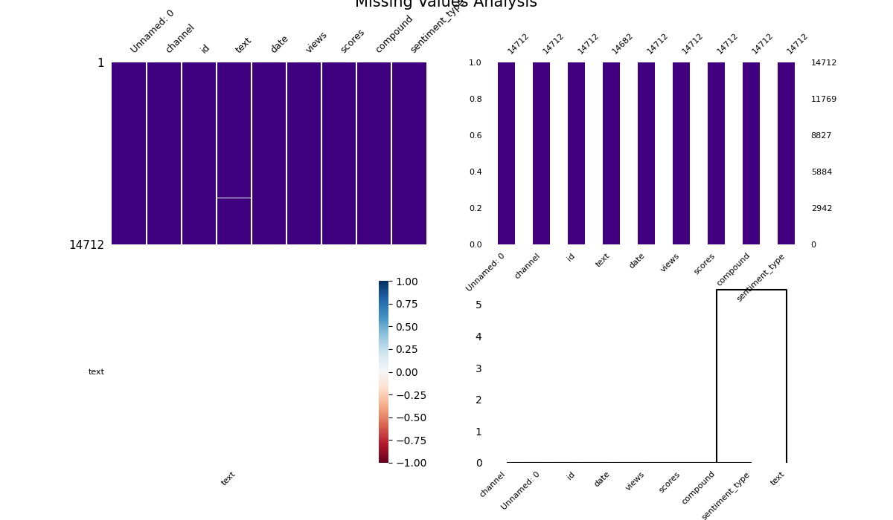

# 📊 Social Media Sentiment Analysis Project

A comprehensive machine learning project for analyzing sentiment patterns in social media data, featuring advanced NLP techniques, multiple ML models, and an interactive Streamlit dashboard for real-time sentiment prediction.

## 🎯 Project Overview

This project implements a complete sentiment analysis pipeline to classify social media posts (specifically Telegram channel messages) into three sentiment categories: **Positive**, **Negative**, and **Neutral**. The project combines traditional machine learning approaches with modern NLP techniques to achieve high accuracy in sentiment classification.

### 🎯 Objectives
- Build a robust sentiment classification system for social media text
- Compare multiple machine learning algorithms and vectorization techniques
- Create comprehensive visualizations to understand sentiment patterns
- Develop an interactive web application for real-time sentiment analysis
- Analyze sentiment trends across different channels and time periods

## 📊 Dataset Information



### 📈 Dataset Overview
- **Source**: Telegram channel messages from crypto/trading communities
- **Total Records**: 14,712 social media posts
- **Channels**: 7 different crypto and trading channels
- **Time Period**: December 2022 - March 2024
- **Languages**: Primarily English posts

### 📋 Dataset Features
- **Text**: Raw message content from Telegram channels
- **Channel**: Source channel name
- **Date**: Timestamp of the message
- **Views**: Number of views for each message
- **Sentiment Scores**: VADER sentiment analysis scores (compound, positive, negative, neutral)
- **Sentiment Type**: Classified sentiment labels (POSITIVE, NEGATIVE, NEUTRAL)

### 📊 Dataset Statistics


- **Positive Posts**: ~60% (8,827 posts)
- **Neutral Posts**: ~26% (3,855 posts) 
- **Negative Posts**: ~14% (2,030 posts)

## 🛠️ Technologies & Tools Used

### 🐍 Core Technologies
- **Python 3.8+**: Primary programming language
- **Jupyter Notebook**: Data exploration and model development
- **Streamlit**: Interactive web application framework

### 📚 Machine Learning & NLP Libraries
- **scikit-learn**: Machine learning algorithms and evaluation metrics
- **NLTK**: Natural language processing and text preprocessing
- **pandas**: Data manipulation and analysis
- **numpy**: Numerical computing

### 📊 Data Visualization
- **matplotlib**: Static plotting and visualizations
- **seaborn**: Statistical data visualization
- **plotly**: Interactive charts and graphs
- **wordcloud**: Word cloud generation

### 🔧 Additional Libraries
- **joblib**: Model serialization and persistence
- **re**: Regular expressions for text cleaning

## 🔬 Methodology & Data Pipeline

### 1. 📊 Data Preprocessing
- **Text Cleaning**: Removal of URLs, special characters, and non-alphabetic content
- **Normalization**: Converting text to lowercase
- **Stopword Removal**: Filtering out common English stopwords using NLTK
- **Lemmatization**: Reducing words to their root form using WordNet lemmatizer
- **Tokenization**: Breaking text into individual words/tokens

### 2. 🎯 Feature Engineering
- **TF-IDF Vectorization**: Converting text to numerical features with up to 5000 features
- **Sentiment Labeling**: Using VADER sentiment analysis for initial labeling
- **Feature Selection**: Identifying most important words for each sentiment class

### 3. 🤖 Model Development & Training
- **Train-Test Split**: 80-20 split for model validation
- **Multiple Algorithm Testing**: Comparison of various ML algorithms
- **Hyperparameter Tuning**: Grid search optimization for best performance
- **Cross-Validation**: Ensuring robust model performance

## 🏆 Model Performance & Results

### 🎯 Primary Model: Multinomial Naive Bayes
- **Overall Accuracy**: **83.21%**
- **Vectorization**: TF-IDF with 5000 features
- **Training Time**: Fast training suitable for real-time applications

### 📊 Detailed Performance Metrics

| Sentiment | Precision | Recall | F1-Score | Support |
|-----------|-----------|--------|----------|---------|
| **NEGATIVE** | 63% | 72% | 67% | 408 |
| **NEUTRAL** | 90% | 73% | 81% | 771 |
| **POSITIVE** | 86% | 90% | 88% | 1,764 |
| **Macro Avg** | 80% | 78% | 79% | 2,943 |
| **Weighted Avg** | 83% | 83% | 83% | 2,943 |

### 🏅 Model Comparison Results

| Algorithm | Accuracy | Best Features |
|-----------|----------|---------------|
| **Logistic Regression** | **94.26%** | Best overall performance |
| **Support Vector Machine** | **93.54%** | Strong classification |
| **Multinomial Naive Bayes** | **83.21%** | Fast inference (deployed) |

*Note: Naive Bayes was selected for deployment due to faster inference time and good balance of performance vs. speed.*

## 📊 Data Analysis & Visualizations

### 📈 Sentiment Trends Analysis


The temporal analysis reveals interesting patterns in sentiment distribution across the crypto community over time, showing how market events influence public sentiment.

### 📺 Channel-wise Sentiment Distribution


Different channels show varying sentiment patterns, indicating diverse community perspectives and content types across the crypto ecosystem.

### 👀 Engagement Analysis


Analysis of view patterns shows which sentiment types generate more engagement, providing insights into community behavior.

### 📊 Text Analysis


Word frequency analysis reveals the most discussed topics and terms in the crypto community conversations.


Visual representation of the most prominent terms across all analyzed posts.

### 📏 Content Characteristics


Distribution analysis of post lengths helps understand communication patterns in social media.

.png)

Sentiment polarity distribution showing the range and frequency of sentiment scores across the dataset.

## 🔍 Key Findings & Insights

### 📊 Sentiment Patterns
- **Positive Bias**: The dataset shows a natural positive bias (60%) typical of crypto communities during growth periods
- **Temporal Variations**: Sentiment patterns correlate with market events and news cycles
- **Channel Diversity**: Different channels exhibit distinct sentiment profiles reflecting their community characteristics

### 🎯 Model Insights
- **High Positive Recall**: The model performs exceptionally well on positive sentiment detection (90% recall)
- **Neutral Classification**: Strong precision (90%) in identifying neutral content
- **Challenging Negatives**: Negative sentiment detection shows room for improvement, likely due to class imbalance

### 💡 Business Applications
- **Real-time Monitoring**: Suitable for monitoring social sentiment in crypto/trading communities
- **Market Intelligence**: Can provide insights into public opinion trends
- **Content Moderation**: Helps identify potentially negative or concerning discussions

## 📁 Project Structure

```
Sentiment_Analysis_on_Social_Media_Data/
├── 📊 app.py                                    # Streamlit web application
├── 📓 Sentiment_Analysis_on_Social_Media.ipynb # Jupyter notebook with analysis
├── 🤖 best_model_nb.joblib                     # Trained Naive Bayes model
├── 🔤 best_tfidf.joblib                        # TF-IDF vectorizer
├── 📋 requirements.txt                          # Python dependencies
├── 📊 telegram_channels_messages14021213_with_sentiment.csv # Dataset
├── 📖 README.md                                 # Project documentation
└── 🖼️ images/                                   # Visualization outputs
    ├── Average Views Per Sentiment.png
    ├── Distribution of Sentiment Types.png
    ├── Sentiment Trends Over Time.png
    ├── Word Cloud of Social Media Posts.png
    └── ... (additional visualizations)
```

## 🚀 Interactive Web Application

The project includes a comprehensive **Streamlit web application** with the following features:

### 🔮 Real-time Sentiment Prediction
- Enter any text for instant sentiment analysis
- View confidence scores and probability distributions
- Test with sample texts from different domains

### 📊 Interactive Visualizations
- Dynamic charts showing sentiment trends over time
- Channel-wise sentiment distribution analysis
- Word clouds for different sentiment categories
- Engagement metrics and view pattern analysis

### 🔍 Data Explorer
- Filter dataset by channels, dates, and sentiment types
- Export filtered results for further analysis
- Interactive data browsing with search capabilities

### 📈 Model Performance Dashboard
- Detailed performance metrics and confusion matrices
- Feature importance visualization
- Model comparison results

## 🎯 Applications & Use Cases

### 📈 Market Intelligence
- **Crypto Market Sentiment**: Monitor community sentiment around cryptocurrencies
- **Trading Signal Analysis**: Identify sentiment-driven trading opportunities
- **Community Health Monitoring**: Track overall sentiment trends in trading communities

### 🔍 Social Media Monitoring
- **Brand Sentiment Tracking**: Monitor public opinion about crypto projects
- **Influencer Analysis**: Analyze sentiment patterns from key opinion leaders
- **Event Impact Assessment**: Measure sentiment changes around major announcements

### 🤖 Automated Analysis
- **Real-time Alerts**: Set up notifications for significant sentiment changes
- **Content Moderation**: Identify potentially problematic content
- **Trend Detection**: Spot emerging sentiment patterns early

## 🔮 Future Enhancements

### 🚀 Model Improvements
- **BERT Integration**: Implement transformer-based models for better accuracy
- **Multi-language Support**: Extend analysis to non-English content
- **Real-time Learning**: Implement online learning for continuous model updates

### 📊 Advanced Analytics
- **Emotion Detection**: Extend beyond sentiment to detect specific emotions
- **Topic Modeling**: Combine sentiment analysis with topic identification
- **Network Analysis**: Analyze sentiment propagation across channels

### 🌐 Deployment Options
- **API Development**: Create REST API for integration with other systems
- **Cloud Deployment**: Deploy on AWS/GCP for scalable analysis
- **Mobile App**: Develop mobile interface for on-the-go analysis

## 📄 License & Usage

This project is available for educational and research purposes. The model and analysis techniques can be adapted for various text classification tasks beyond sentiment analysis.

---

**🎉 Ready to explore social media sentiment analysis?** 
Clone the repository and start analyzing sentiment patterns in your own data!
