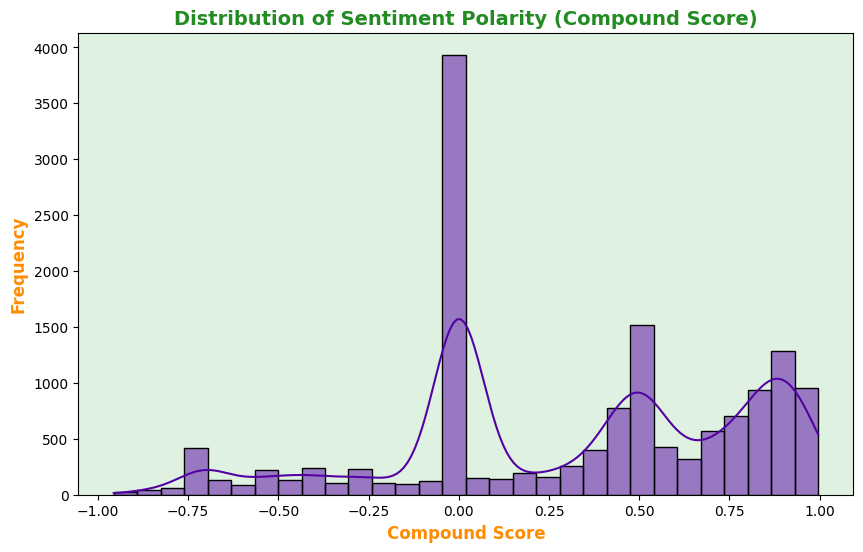
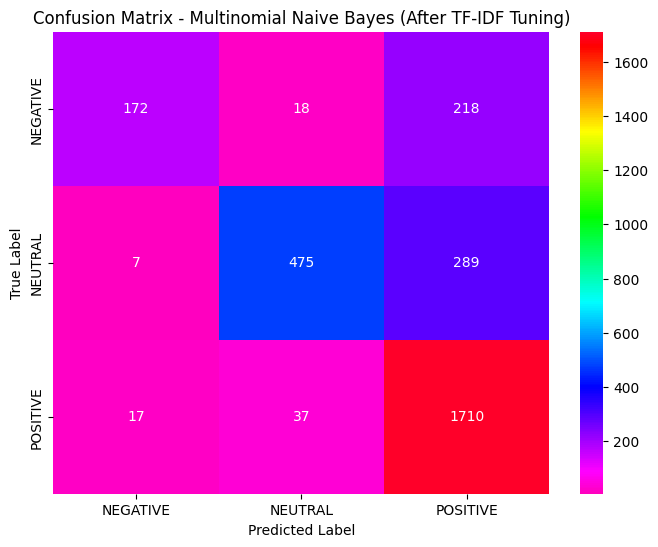

<a href="https://colab.research.google.com/github/bipulhstu/Sentiment_Analysis_on_Social_Media_Data/blob/main/Sentiment_Analysis_on_Social_Media.ipynb" target="_parent"></a>

# **Project 1: Sentiment Analysis on Social Media**

## **📝 Description:**
- *Analyze social media posts or reviews to determine the sentiment (positive, negative, neutral). Use natural language processing (NLP) techniques to preprocess the text and train a sentiment analysis model. Visualize sentiment trends over time or by topic.*


## **Introduction:**
- This project dives into sentiment analysis, where we'll use social media posts to figure out if people are generally feeling positive, negative, or neutral. We'll use a step-by-step process, from cleaning the data to building and improving machine learning models. We'll also experiment with different techniques and visualizations to understand sentiment trends and hopefully build a tool that can automatically analyze public opinion.

## **🔧 Project Structure:**

1. **🧠 Define the Problem:** Understand the objective and type of problem (classification, regression, etc.).
2. **🗂️ Collect and Prepare Data:** Obtain the dataset, handle missing values, and preprocess data.
3. **📊 Exploratory Data Analysis (EDA):** Visualize data to understand patterns and correlations.
4. **📐 Feature Engineering:** Select and create relevant features.
5. **🔀 Split the Data:** Divide the dataset into training and testing sets.
6. **🤖 Choose a Model:** Select a suitable machine learning algorithm.
7. **🏋️ Train the Model:** Train the model using the training set.
8. **📈 Evaluate the Model:** Use appropriate metrics to evaluate the model on the test set.
9. **🔧 Improve the Model:** Tune hyperparameters, try different algorithms, or enhance features.
10. **🚀 Deploy the Model (optional):** Create an application or API to make predictions using the trained model.

##  **🧪 I’ll experiment with:**
- Logistic Regression
- Support Vector Machine (SVM)
- Multinomial Naive Bayes
- LSTM (for deep learning baseline)
- BERT (transformer-based fine-tuning)
- TF-IDF Vectorization
- Word2Vec Embeddings
- BERT Embeddings (for contextual understanding)
- Text Preprocessing Techniques:
  - Lowercasing
  - Removing stop words
  - Lemmatization
  - Tokenization
- SMOTE (to address class imbalance)
- GridSearchCV (for hyperparameter tuning)
- Visualization Tools:
  - Word clouds
  - Sentiment distribution histograms
  - Time series sentiment trends
  - Stacked bar charts (sentiment by topic or category)
  - Confusion matrix heatmaps

#  **1. 🧠 Define the Problem**
- *The problem is to classify the sentiment of social media posts into three categories: positive, negative, or neutral. This is a multi-class classification problem.*


## **Objective:**
- Figure out what you're trying to do. In this case, it's determining if social media posts are generally positive, negative, or neutral in tone.

## **Type:** Multi-class classification (Positive, Negative, Neutral)

## **Import Libraries**

 - `pandas`: For working with data in tables (like spreadsheets). It's used to load the data from the CSV file and manipulate it.
 - `matplotlib.pyplot`: For creating plots and charts to visualize the data or model results.
 - `numpy`: For numerical operations (like math).
 - `sklearn` (scikit-learn): The main machine learning library. It provides tools for:
    - Splitting data into training and testing sets (`train_test_split`).
    - Scaling numerical data (`StandardScaler`).
    - Converting categorical data into a numerical format that models can understand (`OneHotEncoder`).
    - Creating data processing pipelines (`Pipeline`).
    - Building machine learning models (Logistic Regression, Random Forest, and Gradient Boosting).
    - Evaluating model performance (accuracy, precision, recall, F1-score).
    - Finding the best model settings (`GridSearchCV`).
    - Handling missing data (`SimpleImputer`).
    - `seaborn`: A library built on top of matplotlib that provides a higher-level interface for creating informative and aesthetically pleasing statistical graphics.


```python
import pandas as pd
import numpy as np
import re
import nltk
from nltk.corpus import stopwords
from sklearn.model_selection import train_test_split
from sklearn.feature_extraction.text import TfidfVectorizer
from sklearn.naive_bayes import MultinomialNB
from sklearn.linear_model import LogisticRegression
from sklearn.svm import SVC
from sklearn.metrics import accuracy_score, classification_report
import matplotlib.pyplot as plt
import seaborn as sns
from collections import Counter
from nltk.stem import WordNetLemmatizer
from wordcloud import WordCloud
import datetime  # Import the datetime module

import warnings
warnings.filterwarnings("ignore")

# Download necessary NLTK resources
nltk.download('stopwords')
nltk.download('wordnet')
```

    [nltk_data] Downloading package stopwords to /root/nltk_data...
    [nltk_data]   Package stopwords is already up-to-date!
    [nltk_data] Downloading package wordnet to /root/nltk_data...
    [nltk_data]   Package wordnet is already up-to-date!


    True


```python
# Define a color palette
color_palette = sns.color_palette("plasma") # You can change 'viridis' to other palettes
sns.set_palette(color_palette) # Setting the color palette for seaborn
```

# **2. 🗂️Collect and Prepare Data**
- Load your dataset of social media posts

## **📥 Read the CSV Files**


```python
from google.colab import drive
drive.mount('/content/drive')
```

    Mounted at /content/drive


```python
# Load the dataset
df = pd.read_csv("/content/drive/MyDrive/Colab Notebooks/telegram_channels_messages14021213_with_sentiment.csv")
df.head().style.background_gradient(cmap='plasma')
```


<style type="text/css">
#T_57e3a_row0_col0, #T_57e3a_row0_col5, #T_57e3a_row3_col7, #T_57e3a_row4_col2, #T_57e3a_row4_col7 {
  background-color: #0d0887;
  color: #f1f1f1;
}
#T_57e3a_row0_col2, #T_57e3a_row1_col7, #T_57e3a_row2_col5, #T_57e3a_row4_col0 {
  background-color: #f0f921;
  color: #000000;
}
#T_57e3a_row0_col7, #T_57e3a_row2_col7 {
  background-color: #c7427c;
  color: #f1f1f1;
}
#T_57e3a_row1_col0, #T_57e3a_row3_col2 {
  background-color: #7e03a8;
  color: #f1f1f1;
}
#T_57e3a_row1_col2, #T_57e3a_row3_col0 {
  background-color: #f89540;
  color: #000000;
}
#T_57e3a_row1_col5 {
  background-color: #910ea3;
  color: #f1f1f1;
}
#T_57e3a_row2_col0, #T_57e3a_row2_col2 {
  background-color: #cc4778;
  color: #f1f1f1;
}
#T_57e3a_row3_col5 {
  background-color: #fdac33;
  color: #000000;
}
#T_57e3a_row4_col5 {
  background-color: #fa9c3c;
  color: #000000;
}
</style>
<table id="T_57e3a" class="dataframe">
  <thead>
    <tr>
      <th class="blank level0" >&nbsp;</th>
      <th id="T_57e3a_level0_col0" class="col_heading level0 col0" >Unnamed: 0</th>
      <th id="T_57e3a_level0_col1" class="col_heading level0 col1" >channel</th>
      <th id="T_57e3a_level0_col2" class="col_heading level0 col2" >id</th>
      <th id="T_57e3a_level0_col3" class="col_heading level0 col3" >text</th>
      <th id="T_57e3a_level0_col4" class="col_heading level0 col4" >date</th>
      <th id="T_57e3a_level0_col5" class="col_heading level0 col5" >views</th>
      <th id="T_57e3a_level0_col6" class="col_heading level0 col6" >scores</th>
      <th id="T_57e3a_level0_col7" class="col_heading level0 col7" >compound</th>
      <th id="T_57e3a_level0_col8" class="col_heading level0 col8" >sentiment_type</th>
    </tr>
  </thead>
  <tbody>
    <tr>
      <th id="T_57e3a_level0_row0" class="row_heading level0 row0" >0</th>
      <td id="T_57e3a_row0_col0" class="data row0 col0" >0</td>
      <td id="T_57e3a_row0_col1" class="data row0 col1" >binancesignals</td>
      <td id="T_57e3a_row0_col2" class="data row0 col2" >1382</td>
      <td id="T_57e3a_row0_col3" class="data row0 col3" >bitcoin market cap surpasses 13 trillion</td>
      <td id="T_57e3a_row0_col4" class="data row0 col4" >2024-03-04 15:33:04+00:00</td>
      <td id="T_57e3a_row0_col5" class="data row0 col5" >6319.000000</td>
      <td id="T_57e3a_row0_col6" class="data row0 col6" >{'neg': 0.0, 'neu': 1.0, 'pos': 0.0, 'compound': 0.0}</td>
      <td id="T_57e3a_row0_col7" class="data row0 col7" >0.000000</td>
      <td id="T_57e3a_row0_col8" class="data row0 col8" >NEUTRAL</td>
    </tr>
    <tr>
      <th id="T_57e3a_level0_row1" class="row_heading level0 row1" >1</th>
      <td id="T_57e3a_row1_col0" class="data row1 col0" >1</td>
      <td id="T_57e3a_row1_col1" class="data row1 col1" >binancesignals</td>
      <td id="T_57e3a_row1_col2" class="data row1 col2" >1381</td>
      <td id="T_57e3a_row1_col3" class="data row1 col3" >update atausdt long leverage cross x10 smashed second target reached 600 profit using x10 leverage ð</td>
      <td id="T_57e3a_row1_col4" class="data row1 col4" >2024-03-04 10:48:51+00:00</td>
      <td id="T_57e3a_row1_col5" class="data row1 col5" >6847.000000</td>
      <td id="T_57e3a_row1_col6" class="data row1 col6" >{'neg': 0.0, 'neu': 0.751, 'pos': 0.249, 'compound': 0.5106}</td>
      <td id="T_57e3a_row1_col7" class="data row1 col7" >0.510600</td>
      <td id="T_57e3a_row1_col8" class="data row1 col8" >POSITIVE</td>
    </tr>
    <tr>
      <th id="T_57e3a_level0_row2" class="row_heading level0 row2" >2</th>
      <td id="T_57e3a_row2_col0" class="data row2 col0" >2</td>
      <td id="T_57e3a_row2_col1" class="data row2 col1" >binancesignals</td>
      <td id="T_57e3a_row2_col2" class="data row2 col2" >1380</td>
      <td id="T_57e3a_row2_col3" class="data row2 col3" >altcoins started make move bitcoin total market cap hit 14month high altseason finally hereðð</td>
      <td id="T_57e3a_row2_col4" class="data row2 col4" >2024-03-03 18:53:52+00:00</td>
      <td id="T_57e3a_row2_col5" class="data row2 col5" >8066.000000</td>
      <td id="T_57e3a_row2_col6" class="data row2 col6" >{'neg': 0.0, 'neu': 1.0, 'pos': 0.0, 'compound': 0.0}</td>
      <td id="T_57e3a_row2_col7" class="data row2 col7" >0.000000</td>
      <td id="T_57e3a_row2_col8" class="data row2 col8" >NEUTRAL</td>
    </tr>
    <tr>
      <th id="T_57e3a_level0_row3" class="row_heading level0 row3" >3</th>
      <td id="T_57e3a_row3_col0" class="data row3 col0" >3</td>
      <td id="T_57e3a_row3_col1" class="data row3 col1" >binancesignals</td>
      <td id="T_57e3a_row3_col2" class="data row3 col2" >1379</td>
      <td id="T_57e3a_row3_col3" class="data row3 col3" >coin maticusdt timeframe 1d observation broken major horizontal level resistance went retest expecting see large movement upside one first target would 12</td>
      <td id="T_57e3a_row3_col4" class="data row3 col4" >2024-03-03 16:52:07+00:00</td>
      <td id="T_57e3a_row3_col5" class="data row3 col5" >7740.000000</td>
      <td id="T_57e3a_row3_col6" class="data row3 col6" >{'neg': 0.129, 'neu': 0.871, 'pos': 0.0, 'compound': -0.4767}</td>
      <td id="T_57e3a_row3_col7" class="data row3 col7" >-0.476700</td>
      <td id="T_57e3a_row3_col8" class="data row3 col8" >NEGATIVE</td>
    </tr>
    <tr>
      <th id="T_57e3a_level0_row4" class="row_heading level0 row4" >4</th>
      <td id="T_57e3a_row4_col0" class="data row4 col0" >4</td>
      <td id="T_57e3a_row4_col1" class="data row4 col1" >binancesignals</td>
      <td id="T_57e3a_row4_col2" class="data row4 col2" >1378</td>
      <td id="T_57e3a_row4_col3" class="data row4 col3" >coin aptusdt timeframe 1d observation broken major horizontal level resistance went liquidity grab expecting see pullback upside 15</td>
      <td id="T_57e3a_row4_col4" class="data row4 col4" >2024-03-03 16:50:49+00:00</td>
      <td id="T_57e3a_row4_col5" class="data row4 col5" >7668.000000</td>
      <td id="T_57e3a_row4_col6" class="data row4 col6" >{'neg': 0.154, 'neu': 0.846, 'pos': 0.0, 'compound': -0.4767}</td>
      <td id="T_57e3a_row4_col7" class="data row4 col7" >-0.476700</td>
      <td id="T_57e3a_row4_col8" class="data row4 col8" >NEGATIVE</td>
    </tr>
  </tbody>
</table>


```python
df.describe().style.background_gradient(cmap='tab20c')
```


<style type="text/css">
#T_aebff_row0_col0, #T_aebff_row0_col1, #T_aebff_row0_col3, #T_aebff_row7_col0, #T_aebff_row7_col2 {
  background-color: #d9d9d9;
  color: #000000;
}
#T_aebff_row0_col2, #T_aebff_row1_col2, #T_aebff_row1_col3, #T_aebff_row2_col2, #T_aebff_row2_col3, #T_aebff_row3_col0, #T_aebff_row3_col1, #T_aebff_row3_col2, #T_aebff_row3_col3, #T_aebff_row4_col2, #T_aebff_row4_col3, #T_aebff_row5_col2, #T_aebff_row5_col3, #T_aebff_row6_col3, #T_aebff_row7_col3 {
  background-color: #3182bd;
  color: #f1f1f1;
}
#T_aebff_row1_col0, #T_aebff_row5_col0 {
  background-color: #a1d99b;
  color: #000000;
}
#T_aebff_row1_col1 {
  background-color: #fdd0a2;
  color: #000000;
}
#T_aebff_row2_col0 {
  background-color: #fd8d3c;
  color: #f1f1f1;
}
#T_aebff_row2_col1, #T_aebff_row4_col0 {
  background-color: #e6550d;
  color: #f1f1f1;
}
#T_aebff_row4_col1 {
  background-color: #c6dbef;
  color: #000000;
}
#T_aebff_row5_col1 {
  background-color: #31a354;
  color: #f1f1f1;
}
#T_aebff_row6_col0 {
  background-color: #dadaeb;
  color: #000000;
}
#T_aebff_row6_col1 {
  background-color: #c7e9c0;
  color: #000000;
}
#T_aebff_row6_col2 {
  background-color: #6baed6;
  color: #f1f1f1;
}
#T_aebff_row7_col1 {
  background-color: #bcbddc;
  color: #000000;
}
</style>
<table id="T_aebff" class="dataframe">
  <thead>
    <tr>
      <th class="blank level0" >&nbsp;</th>
      <th id="T_aebff_level0_col0" class="col_heading level0 col0" >Unnamed: 0</th>
      <th id="T_aebff_level0_col1" class="col_heading level0 col1" >id</th>
      <th id="T_aebff_level0_col2" class="col_heading level0 col2" >views</th>
      <th id="T_aebff_level0_col3" class="col_heading level0 col3" >compound</th>
    </tr>
  </thead>
  <tbody>
    <tr>
      <th id="T_aebff_level0_row0" class="row_heading level0 row0" >count</th>
      <td id="T_aebff_row0_col0" class="data row0 col0" >14712.000000</td>
      <td id="T_aebff_row0_col1" class="data row0 col1" >14712.000000</td>
      <td id="T_aebff_row0_col2" class="data row0 col2" >14712.000000</td>
      <td id="T_aebff_row0_col3" class="data row0 col3" >14712.000000</td>
    </tr>
    <tr>
      <th id="T_aebff_level0_row1" class="row_heading level0 row1" >mean</th>
      <td id="T_aebff_row1_col0" class="data row1 col0" >7695.078915</td>
      <td id="T_aebff_row1_col1" class="data row1 col1" >5731.983415</td>
      <td id="T_aebff_row1_col2" class="data row1 col2" >14737.631525</td>
      <td id="T_aebff_row1_col3" class="data row1 col3" >0.323880</td>
    </tr>
    <tr>
      <th id="T_aebff_level0_row2" class="row_heading level0 row2" >std</th>
      <td id="T_aebff_row2_col0" class="data row2 col0" >4430.002318</td>
      <td id="T_aebff_row2_col1" class="data row2 col1" >3185.394956</td>
      <td id="T_aebff_row2_col2" class="data row2 col2" >12069.131738</td>
      <td id="T_aebff_row2_col3" class="data row2 col3" >0.468967</td>
    </tr>
    <tr>
      <th id="T_aebff_level0_row3" class="row_heading level0 row3" >min</th>
      <td id="T_aebff_row3_col0" class="data row3 col0" >0.000000</td>
      <td id="T_aebff_row3_col1" class="data row3 col1" >7.000000</td>
      <td id="T_aebff_row3_col2" class="data row3 col2" >39.000000</td>
      <td id="T_aebff_row3_col3" class="data row3 col3" >-0.956500</td>
    </tr>
    <tr>
      <th id="T_aebff_level0_row4" class="row_heading level0 row4" >25%</th>
      <td id="T_aebff_row4_col0" class="data row4 col0" >3825.750000</td>
      <td id="T_aebff_row4_col1" class="data row4 col1" >2620.500000</td>
      <td id="T_aebff_row4_col2" class="data row4 col2" >7513.750000</td>
      <td id="T_aebff_row4_col3" class="data row4 col3" >0.000000</td>
    </tr>
    <tr>
      <th id="T_aebff_level0_row5" class="row_heading level0 row5" >50%</th>
      <td id="T_aebff_row5_col0" class="data row5 col0" >7702.500000</td>
      <td id="T_aebff_row5_col1" class="data row5 col1" >6559.000000</td>
      <td id="T_aebff_row5_col2" class="data row5 col2" >11528.000000</td>
      <td id="T_aebff_row5_col3" class="data row5 col3" >0.440400</td>
    </tr>
    <tr>
      <th id="T_aebff_level0_row6" class="row_heading level0 row6" >75%</th>
      <td id="T_aebff_row6_col0" class="data row6 col0" >11527.250000</td>
      <td id="T_aebff_row6_col1" class="data row6 col1" >8412.000000</td>
      <td id="T_aebff_row6_col2" class="data row6 col2" >21654.250000</td>
      <td id="T_aebff_row6_col3" class="data row6 col3" >0.765000</td>
    </tr>
    <tr>
      <th id="T_aebff_level0_row7" class="row_heading level0 row7" >max</th>
      <td id="T_aebff_row7_col0" class="data row7 col0" >15358.000000</td>
      <td id="T_aebff_row7_col1" class="data row7 col1" >10554.000000</td>
      <td id="T_aebff_row7_col2" class="data row7 col2" >375298.000000</td>
      <td id="T_aebff_row7_col3" class="data row7 col3" >0.995800</td>
    </tr>
  </tbody>
</table>


## Check the missing values


```python
import missingno as msno

fig, ax = plt.subplots(2,2,figsize=(12,7))
axs = np.ravel(ax)
msno.matrix(df,  fontsize=9, color=(0.25,0,0.5),ax=axs[0]);
msno.bar(df, fontsize=8, color=(0.25,0,0.5), ax=axs[1]);
msno.heatmap(df,fontsize=8,ax=axs[2]);
msno.dendrogram(df,fontsize=8,ax=axs[3], orientation='top')

fig.suptitle('Missing Values Analysis', y=1.01, fontsize=15)

# Save the plot
plt.savefig('missing_values_analysis.png')

# Show the plot
plt.show()
```


    

    


## **🧹Data Cleaning and Preprocessing**

## **Clean the Text:**
   - Remove unnecessary stuff from the text, like website addresses, usernames, and special symbols.
   - Convert everything to lowercase to keep things consistent.
   - Deal with any missing posts, usually just filling them with empty text.

## **Prepare the Text**:
   - Break the text into individual words.
   - Get rid of common words that don't help with sentiment (like "the", "a", "is"). These are called "stopwords."
   - Simplify words to their base form (e.g., "running" becomes "run"). This is called "lemmatization."


```python
def clean_text(text):
    """
    Cleans the input text by removing special characters, URLs, and converting to lowercase.
    """
    if isinstance(text, str):  # Check if the input is a string
        text = re.sub(r'http\S+|www\S+|@\S+', '', text, flags=re.MULTILINE) # Remove URLs and mentions
        text = re.sub(r'[^a-zA-Z]', ' ', text) # Remove special characters and numbers
        text = text.lower() # Convert to lowercase
        return text
    else:
        return ""  # Return an empty string for non-string values

df['cleaned_text'] = df['text'].apply(clean_text)
print(df[['text', 'cleaned_text']].head())

def preprocess_text(text):
    """
    Tokenizes, removes stopwords, and lemmatizes the input text.
    """
    # Tokenize the text
    words = text.split()
    # Remove stopwords
    stop_words = set(stopwords.words('english'))
    words = [w for w in words if not w in stop_words]
    # Lemmatize the words
    lemmatizer = WordNetLemmatizer()
    words = [lemmatizer.lemmatize(w) for w in words]
    # Join the words back into one string
    return ' '.join(words)

df['processed_text'] = df['cleaned_text'].apply(preprocess_text)
print(df[['cleaned_text', 'processed_text']].head())
```

                                                    text  \
    0           bitcoin market cap surpasses 13 trillion   
    1  update atausdt long leverage cross x10 smashed...   
    2  altcoins started make move bitcoin total marke...   
    3  coin maticusdt timeframe 1d observation broken...   
    4  coin aptusdt timeframe 1d observation broken m...   
    
                                            cleaned_text  
    0           bitcoin market cap surpasses    trillion  
    1  update atausdt long leverage cross x   smashed...  
    2  altcoins started make move bitcoin total marke...  
    3  coin maticusdt timeframe  d observation broken...  
    4  coin aptusdt timeframe  d observation broken m...  
                                            cleaned_text  \
    0           bitcoin market cap surpasses    trillion   
    1  update atausdt long leverage cross x   smashed...   
    2  altcoins started make move bitcoin total marke...   
    3  coin maticusdt timeframe  d observation broken...   
    4  coin aptusdt timeframe  d observation broken m...   
    
                                          processed_text  
    0              bitcoin market cap surpasses trillion  
    1  update atausdt long leverage cross x smashed s...  
    2  altcoins started make move bitcoin total marke...  
    3  coin maticusdt timeframe observation broken ma...  
    4  coin aptusdt timeframe observation broken majo...  


```python
# Handling Missing Values
print("Missing values before handling:")
df.isnull().sum()

```

    Missing values before handling:


<div>
<style scoped>
    .dataframe tbody tr th:only-of-type {
        vertical-align: middle;
    }

    .dataframe tbody tr th {
        vertical-align: top;
    }

    .dataframe thead th {
        text-align: right;
    }
</style>
<table border="1" class="dataframe">
  <thead>
    <tr style="text-align: right;">
      <th></th>
      <th>0</th>
    </tr>
  </thead>
  <tbody>
    <tr>
      <th>Unnamed: 0</th>
      <td>0</td>
    </tr>
    <tr>
      <th>channel</th>
      <td>0</td>
    </tr>
    <tr>
      <th>id</th>
      <td>0</td>
    </tr>
    <tr>
      <th>text</th>
      <td>30</td>
    </tr>
    <tr>
      <th>date</th>
      <td>0</td>
    </tr>
    <tr>
      <th>views</th>
      <td>0</td>
    </tr>
    <tr>
      <th>scores</th>
      <td>0</td>
    </tr>
    <tr>
      <th>compound</th>
      <td>0</td>
    </tr>
    <tr>
      <th>sentiment_type</th>
      <td>0</td>
    </tr>
    <tr>
      <th>cleaned_text</th>
      <td>0</td>
    </tr>
    <tr>
      <th>processed_text</th>
      <td>0</td>
    </tr>
  </tbody>
</table>
</div><br><label><b>dtype:</b> int64</label>


```python
# For simplicity, I'll fill missing text with an empty string
df['text'] = df['text'].fillna('')
df['processed_text'] = df['processed_text'].fillna('')
print("\nMissing values after handling:")
df.isnull().sum()
```

    
    Missing values after handling:


<div>
<style scoped>
    .dataframe tbody tr th:only-of-type {
        vertical-align: middle;
    }

    .dataframe tbody tr th {
        vertical-align: top;
    }

    .dataframe thead th {
        text-align: right;
    }
</style>
<table border="1" class="dataframe">
  <thead>
    <tr style="text-align: right;">
      <th></th>
      <th>0</th>
    </tr>
  </thead>
  <tbody>
    <tr>
      <th>Unnamed: 0</th>
      <td>0</td>
    </tr>
    <tr>
      <th>channel</th>
      <td>0</td>
    </tr>
    <tr>
      <th>id</th>
      <td>0</td>
    </tr>
    <tr>
      <th>text</th>
      <td>0</td>
    </tr>
    <tr>
      <th>date</th>
      <td>0</td>
    </tr>
    <tr>
      <th>views</th>
      <td>0</td>
    </tr>
    <tr>
      <th>scores</th>
      <td>0</td>
    </tr>
    <tr>
      <th>compound</th>
      <td>0</td>
    </tr>
    <tr>
      <th>sentiment_type</th>
      <td>0</td>
    </tr>
    <tr>
      <th>cleaned_text</th>
      <td>0</td>
    </tr>
    <tr>
      <th>processed_text</th>
      <td>0</td>
    </tr>
  </tbody>
</table>
</div><br><label><b>dtype:</b> int64</label>


# **3. 📊 Exploratory Data Analysis (EDA)**


## **3.1. Sentiment Distribution:**

- Look at how many posts fall into each sentiment category (positive, negative, neutral). Visualize it with a bar chart.


```python
# Sentiment Distribution
sentiment_counts = df['sentiment_type'].value_counts()
print("\nSentiment Distribution:\n", sentiment_counts)
plt.figure(figsize=(8, 6))
ax = sns.barplot(x=sentiment_counts.index, y=sentiment_counts.values)
plt.title('Distribution of Sentiment Types', fontsize = 14, fontweight = 'bold', color = 'forestgreen')
plt.xlabel('Sentiment',fontsize = 12, fontweight = 'bold', color = 'darkblue')
plt.ylabel('Number of Posts',fontsize = 12, fontweight = 'bold', color = 'darkblue')
plt.gca().set_facecolor('#dff2e1')

# Add values on top of the bars
for p in ax.patches:
    ax.annotate(f'{p.get_height():.0f}', (p.get_x() + p.get_width() / 2., p.get_height()),
                ha='center', va='center', xytext=(0, 5), textcoords='offset points')

plt.show()
```

    
    Sentiment Distribution:
     sentiment_type
    POSITIVE    8789
    NEUTRAL     3879
    NEGATIVE    2044
    Name: count, dtype: int64


    

    


## **3.2. Most Common Words:**

- Find the **most frequent words** in the posts to get a sense of the topics being discussed. Show it with a bar chart too.


```python
# Most Common Words
def plot_most_common_words(text_series, top_n=20):
    """
    Plots the most common words in a text series.
    """
    all_words = ' '.join(text_series).split()
    word_counts = Counter(all_words)
    most_common_words = word_counts.most_common(top_n)
    print("Most Common Words:", most_common_words)
    words, counts = zip(*most_common_words)
    plt.figure(figsize=(12, 6))
    ax = sns.barplot(x=list(words), y=list(counts))
    plt.xticks(rotation=45)
    plt.title('Most Common Words', fontsize = 14, fontweight = 'bold', color = 'forestgreen')
    plt.xlabel('Words',fontsize = 12, fontweight = 'bold', color = 'deeppink')
    plt.ylabel('Frequency',fontsize = 12, fontweight = 'bold', color = 'deeppink')
    plt.gca().set_facecolor('#dff2e1')

    #Add values to the  most common words
    for p in ax.patches:
        ax.annotate(f'{p.get_height():.0f}', (p.get_x() + p.get_width() / 2., p.get_height()),
                    ha='center', va='center', xytext=(0, 5), textcoords='offset points')

    plt.show()

plot_most_common_words(df['processed_text'])

```

    Most Common Words: [('vip', 8531), ('market', 5609), ('binance', 5335), ('target', 5105), ('bitcoin', 4529), ('trading', 3812), ('killer', 3811), ('x', 3571), ('profit', 3527), ('level', 3410), ('update', 3284), ('btc', 3222), ('bullet', 3124), ('top', 2906), ('h', 2671), ('move', 2421), ('crypto', 2418), ('content', 2267), ('price', 2156), ('long', 2148)]


    

    


## **3.3. Sentiment Distribution by Channel:**
- **Channel Sentiment**: See how sentiment varies across different social media channels.


```python
# Sentiment Distribution by Channel
channel_sentiment = df.groupby('channel')['sentiment_type'].value_counts().unstack(fill_value=0)
print("Sentiment Distribution by Channel:\n", channel_sentiment)
plt.figure(figsize=(12, 6))
ax = channel_sentiment.plot(kind='bar', stacked=True, figsize=(12, 6))
plt.title('Sentiment Distribution by Channel', fontsize = 14, fontweight = 'bold', color = 'forestgreen')
plt.xlabel('Channel',fontsize = 12, fontweight = 'bold', color = 'deeppink')
plt.ylabel('Number of Posts',fontsize = 12, fontweight = 'bold', color = 'deeppink')
plt.legend(title='Sentiment')
plt.gca().set_facecolor('#dff2e1')

for p in ax.patches:
    width, height = p.get_width(), p.get_height()
    x, y = p.get_xy()
    ax.annotate(f'{height:.0f}', (x + width/2, y + height/2),
                ha='center', va='center', xytext=(0, 0), textcoords='offset points', color='black')

plt.show()
```

    Sentiment Distribution by Channel:
     sentiment_type          NEGATIVE  NEUTRAL  POSITIVE
    channel                                            
    BitcoinBullets               285     1216      2291
    CryptoScanner100eyes           0      249       344
    VerifiedCryptoNews           149      222       450
    binancekillers               427     1116      3732
    binancesignals               704      642      1136
    universalcryptosignals         4        0        13
    wolfoftrading                475      434       823


    <Figure size 1200x600 with 0 Axes>


    

    


## **3.4. Sentiment Trends Over Time:**
- Sentiment Trends: Observe how sentiment changes over time (e.g., daily).


```python
# Sentiment Trends Over Time
# Convert 'date' to datetime objects, handling potential parsing issues
df['date'] = pd.to_datetime(df['date'], errors='coerce')

# If 'date' column has any NaT values (failed parsing), handle them
df = df.dropna(subset=['date'])

# Group by date and sentiment type
daily_sentiment = df.groupby([df['date'].dt.date, 'sentiment_type']).size().unstack(fill_value=0)
print("Daily Sentiment Counts:\n", daily_sentiment.head())
# Plot sentiment trends over time
daily_sentiment.plot(figsize=(14, 7))
plt.title('Sentiment Trends Over Time', fontsize = 14, fontweight = 'bold', color = 'forestgreen')
plt.xlabel('Date',fontsize = 12, fontweight = 'bold', color = 'darkcyan')
plt.ylabel('Number of Posts',fontsize = 12, fontweight = 'bold', color = 'darkcyan')
plt.legend(title='Sentiment')
plt.xticks(rotation=45)  # Rotate date labels for readability
plt.tight_layout()  # Adjust layout to prevent labels from overlapping
plt.gca().set_facecolor('#dff2e1')
plt.show()
```

    Daily Sentiment Counts:
     sentiment_type  NEGATIVE  NEUTRAL  POSITIVE
    date                                       
    2022-12-01             0        1         4
    2022-12-02             1        2         7
    2022-12-03             3        1        15
    2022-12-04             3        5         7
    2022-12-05             2        6         6


    

    


## **3.5. Word Cloud Visualization:**
- Word Clouds: Visually represent the most common words.


```python
#  Word Cloud Visualization
def generate_word_cloud(text):
    """
    Generates and displays a word cloud from the given text.
    """
    # Check if the text list is empty
    if not text:
        print("No text available to generate word cloud.")
        return None  # Return None if no text

    wordcloud = WordCloud(width=800, height=400, background_color='white').generate(' '.join(text))
    plt.figure(figsize=(10, 5))
    plt.imshow(wordcloud, interpolation='bilinear')
    plt.axis('off')
    plt.title('Word Cloud of Social Media Posts', fontsize = 14, fontweight = 'bold', color = 'forestgreen')
    plt.gca().set_facecolor('#dff2e1')
    plt.show()
    return True # return True if wordcloud is generated
```

### **3.5.1. Positive Words Cloud:**


```python
# Positive Words Cloud
positive_text = df[df['sentiment_type'] == 'POSITIVE']['processed_text'].tolist() # Convert series to list
plt.title('Word Cloud for Positive Sentiments')
if generate_word_cloud(positive_text):
    print("Positive Word Cloud Generated")
else:
    print("No positive sentiment data available.")

```


    

    


    

    


    Positive Word Cloud Generated


### **3.5.2. Negative Words Cloud:**


```python
# Negative Words Word Cloud
negative_text = df[df['sentiment_type'] == 'NEGATIVE']['processed_text'].tolist() # Convert series to list
plt.title('Word Cloud for Negative Sentiments')
if generate_word_cloud(negative_text):
    print("Negative Word Cloud Generated")
else:
    print("No negative sentiment data available.")
```


    

    


    

    


    Negative Word Cloud Generated


## **3.6. Average Views per Sentiment:**
- Views vs. Sentiment: Check if certain sentiments are linked to more views.


```python
# Average Views per Sentiment
avg_views_sentiment = df.groupby('sentiment_type')['views'].mean()
print("\nAverage Views per Sentiment:\n", avg_views_sentiment)

plt.figure(figsize=(8, 6))
ax = sns.barplot(x=avg_views_sentiment.index, y=avg_views_sentiment.values)
plt.title('Average Views per Sentiment', fontsize = 14, fontweight = 'bold', color = 'forestgreen')
plt.xlabel('Sentiment',fontsize = 12, fontweight = 'bold', color = 'darkcyan')
plt.ylabel('Average Views',fontsize = 12, fontweight = 'bold', color = 'darkcyan')
plt.gca().set_facecolor('#dff2e1')

# Add values on top of the bars
for p in ax.patches:
    ax.annotate(f'{p.get_height():.0f}', (p.get_x() + p.get_width() / 2., p.get_height()),
                ha='center', va='center', xytext=(0, 5), textcoords='offset points')

plt.show()
```

    
    Average Views per Sentiment:
     sentiment_type
    NEGATIVE    15733.133072
    NEUTRAL     13376.656097
    POSITIVE    15106.776880
    Name: views, dtype: float64


    

    


## **3.7. Sentiment Polarity Distribution:**
- Polarity Distribution: Understand the spread of sentiment "strength".


```python
# Sentiment Polarity Distribution
# (The 'compound' score represents sentiment polarity)
plt.figure(figsize=(10, 6))
sns.histplot(df['compound'], bins=30, kde=True)
plt.title('Distribution of Sentiment Polarity (Compound Score)', fontsize = 14, fontweight = 'bold', color = 'forestgreen')
plt.xlabel('Compound Score',fontsize = 12, fontweight = 'bold', color = 'darkorange')
plt.ylabel('Frequency',fontsize = 12, fontweight = 'bold', color = 'darkorange')
plt.gca().set_facecolor('#dff2e1')
plt.show()

```


    

    


## **3.8. Sentiment Ratio Over Time (Positive vs. Negative):**
- Sentiment Ratio: Compare the proportion of positive vs. negative sentiments over time.


```python
# Sentiment Ratio Over Time (Positive vs. Negative)
# Group by date and sentiment type
daily_sentiment = df.groupby(df['date'].dt.date)['sentiment_type'].value_counts().unstack(fill_value=0)

# Calculate total sentiment counts for each day
daily_sentiment['Total'] = daily_sentiment['POSITIVE'] + daily_sentiment['NEGATIVE'] + daily_sentiment['NEUTRAL']

# Calculate sentiment ratio
daily_sentiment['Positive Ratio'] = daily_sentiment['POSITIVE'] / daily_sentiment['Total']
daily_sentiment['Negative Ratio'] = daily_sentiment['NEGATIVE'] / daily_sentiment['Total']
print("Daily Sentiment Ratios:\n", daily_sentiment[['Positive Ratio', 'Negative Ratio']].head())

# Plot sentiment ratio trends
plt.figure(figsize=(14, 7))
plt.plot(daily_sentiment.index, daily_sentiment['Positive Ratio'], label='Positive Ratio')
plt.plot(daily_sentiment.index, daily_sentiment['Negative Ratio'], label='Negative Ratio')
plt.title('Sentiment Ratio Over Time', fontsize = 14, fontweight = 'bold', color = 'forestgreen')
plt.xlabel('Date',fontsize = 12, fontweight = 'bold', color = 'darkorange')
plt.ylabel('Sentiment Ratio',fontsize = 12, fontweight = 'bold', color = 'darkorange')
plt.legend(title='Sentiment')
plt.xticks(rotation=45)
plt.tight_layout()
plt.gca().set_facecolor('#dff2e1')
plt.show()

```

    Daily Sentiment Ratios:
     sentiment_type  Positive Ratio  Negative Ratio
    date                                          
    2022-12-01            0.800000        0.000000
    2022-12-02            0.700000        0.100000
    2022-12-03            0.789474        0.157895
    2022-12-04            0.466667        0.200000
    2022-12-05            0.428571        0.142857


    

    


## **3.9. Top N-grams (Bigrams) Analysis:**
- N-gram Analysis: Identify common phrases (two-word combinations) in the text.


```python
# Top N-grams (Bigrams) Analysis
from sklearn.feature_extraction.text import CountVectorizer

def plot_top_ngrams(text, n=2, top_n=20):
    """
    Plots the most frequent n-grams in a given text series.
    """
    vec = CountVectorizer(ngram_range=(n, n)).fit(text)
    bag_of_words = vec.transform(text)
    sum_words = bag_of_words.sum(axis=0)
    words_freq = [(word, sum_words[0, idx]) for word, idx in vec.vocabulary_.items()]
    words_freq = sorted(words_freq, key=lambda x: x[1], reverse=True)
    top_words = words_freq[:top_n]
    print(f"Top {top_n} {n}-grams:", top_words)
    df_top_words = pd.DataFrame(top_words, columns=['ngram', 'count'])
    plt.figure(figsize=(12, 6))
    sns.barplot(x='count', y='ngram', data=df_top_words)
    plt.title(f'Top {top_n} {n}-grams')
    plt.xlabel('Frequency',fontsize = 12, fontweight = 'bold', color = 'darkorange')
    plt.ylabel('N-gram',fontsize = 12, fontweight = 'bold', color = 'darkorange')
    plt.gca().set_facecolor('#dff2e1')
    plt.show()

plot_top_ngrams(df['processed_text'], n=2, top_n=20)


```

    Top 20 2-grams: [('binance killer', np.int64(3455)), ('bitcoin bullet', np.int64(3064)), ('bullet trading', np.int64(2607)), ('target target', np.int64(2428)), ('vip content', np.int64(2205)), ('tp tp', np.int64(1590)), ('top gainer', np.int64(1290)), ('target profit', np.int64(1227)), ('crypto market', np.int64(1177)), ('market analysis', np.int64(1137)), ('never miss', np.int64(1096)), ('miss another', np.int64(1094)), ('signal id', np.int64(1019)), ('price action', np.int64(989)), ('market update', np.int64(976)), ('vip market', np.int64(964)), ('short term', np.int64(935)), ('limit vip', np.int64(877)), ('message tmebkceo', np.int64(820)), ('market cap', np.int64(765))]


    

    


## **3.10. Distribution of Text Length:**
- Text Length: Analyze the length of the posts.


```python
# Distribution of Text Length
text_length = df['processed_text'].apply(lambda x: len(x.split()))
print("Text Length Summary:\n", text_length.describe())
plt.figure(figsize=(10, 6))
sns.histplot(text_length, bins=50)
plt.title('Distribution of Text Length', fontsize = 14, fontweight = 'bold', color = 'forestgreen')
plt.xlabel('Text Length (Number of Words)',fontsize = 12, fontweight = 'bold', color = 'saddlebrown')
plt.ylabel('Frequency',fontsize = 12, fontweight = 'bold', color = 'saddlebrown')
plt.gca().set_facecolor('#dff2e1')
plt.show()
```

    Text Length Summary:
     count    14712.000000
    mean        21.269168
    std         22.797937
    min          0.000000
    25%          7.000000
    50%         14.000000
    75%         27.000000
    max        306.000000
    Name: processed_text, dtype: float64


    

    


# **4. 📐 Feature Engineering**
- Turn Text into Numbers: Computers can't understand text directly. Use a technique called TF-IDF to convert the text into numerical data that the model can use. Essentially, it counts words but also adjusts for how common they are in the entire dataset.


```python
# Using TF-IDF to convert text to numerical data.
tfidf_vectorizer = TfidfVectorizer(max_features=5000)  # Limiting features to 5000
X = tfidf_vectorizer.fit_transform(df['processed_text'])
y = df['sentiment_type']

```

# **5. 🔀 Split the Data**
- Divide your data into two sets: one to train the model (teaching it to recognize sentiment) and another to test how well it learned (evaluating its performance).


```python
# Split the Data:
X_train, X_test, y_train, y_test = train_test_split(X, y, test_size=0.2, random_state=42)

```

# **6. 🤖 Choose a Model**
- Select a suitable algorithm to classify the sentiment. Naive Bayes is a common choice for text classification.


```python
# Multinomial Naive Bayes is suitable for text classification.
model = MultinomialNB()
```

# **7. 🏋️ Train the Model**
- Feed the training data (the numerical representation of the text and their corresponding sentiments) to the model so it can learn the patterns.


```python
model.fit(X_train, y_train)
```


<style>#sk-container-id-1 {
  /* Definition of color scheme common for light and dark mode */
  --sklearn-color-text: #000;
  --sklearn-color-text-muted: #666;
  --sklearn-color-line: gray;
  /* Definition of color scheme for unfitted estimators */
  --sklearn-color-unfitted-level-0: #fff5e6;
  --sklearn-color-unfitted-level-1: #f6e4d2;
  --sklearn-color-unfitted-level-2: #ffe0b3;
  --sklearn-color-unfitted-level-3: chocolate;
  /* Definition of color scheme for fitted estimators */
  --sklearn-color-fitted-level-0: #f0f8ff;
  --sklearn-color-fitted-level-1: #d4ebff;
  --sklearn-color-fitted-level-2: #b3dbfd;
  --sklearn-color-fitted-level-3: cornflowerblue;

  /* Specific color for light theme */
  --sklearn-color-text-on-default-background: var(--sg-text-color, var(--theme-code-foreground, var(--jp-content-font-color1, black)));
  --sklearn-color-background: var(--sg-background-color, var(--theme-background, var(--jp-layout-color0, white)));
  --sklearn-color-border-box: var(--sg-text-color, var(--theme-code-foreground, var(--jp-content-font-color1, black)));
  --sklearn-color-icon: #696969;

  @media (prefers-color-scheme: dark) {
    /* Redefinition of color scheme for dark theme */
    --sklearn-color-text-on-default-background: var(--sg-text-color, var(--theme-code-foreground, var(--jp-content-font-color1, white)));
    --sklearn-color-background: var(--sg-background-color, var(--theme-background, var(--jp-layout-color0, #111)));
    --sklearn-color-border-box: var(--sg-text-color, var(--theme-code-foreground, var(--jp-content-font-color1, white)));
    --sklearn-color-icon: #878787;
  }
}

#sk-container-id-1 {
  color: var(--sklearn-color-text);
}

#sk-container-id-1 pre {
  padding: 0;
}

#sk-container-id-1 input.sk-hidden--visually {
  border: 0;
  clip: rect(1px 1px 1px 1px);
  clip: rect(1px, 1px, 1px, 1px);
  height: 1px;
  margin: -1px;
  overflow: hidden;
  padding: 0;
  position: absolute;
  width: 1px;
}

#sk-container-id-1 div.sk-dashed-wrapped {
  border: 1px dashed var(--sklearn-color-line);
  margin: 0 0.4em 0.5em 0.4em;
  box-sizing: border-box;
  padding-bottom: 0.4em;
  background-color: var(--sklearn-color-background);
}

#sk-container-id-1 div.sk-container {
  /* jupyter's `normalize.less` sets `[hidden] { display: none; }`
     but bootstrap.min.css set `[hidden] { display: none !important; }`
     so we also need the `!important` here to be able to override the
     default hidden behavior on the sphinx rendered scikit-learn.org.
     See: https://github.com/scikit-learn/scikit-learn/issues/21755 */
  display: inline-block !important;
  position: relative;
}

#sk-container-id-1 div.sk-text-repr-fallback {
  display: none;
}

div.sk-parallel-item,
div.sk-serial,
div.sk-item {
  /* draw centered vertical line to link estimators */
  background-image: linear-gradient(var(--sklearn-color-text-on-default-background), var(--sklearn-color-text-on-default-background));
  background-size: 2px 100%;
  background-repeat: no-repeat;
  background-position: center center;
}

/* Parallel-specific style estimator block */

#sk-container-id-1 div.sk-parallel-item::after {
  content: "";
  width: 100%;
  border-bottom: 2px solid var(--sklearn-color-text-on-default-background);
  flex-grow: 1;
}

#sk-container-id-1 div.sk-parallel {
  display: flex;
  align-items: stretch;
  justify-content: center;
  background-color: var(--sklearn-color-background);
  position: relative;
}

#sk-container-id-1 div.sk-parallel-item {
  display: flex;
  flex-direction: column;
}

#sk-container-id-1 div.sk-parallel-item:first-child::after {
  align-self: flex-end;
  width: 50%;
}

#sk-container-id-1 div.sk-parallel-item:last-child::after {
  align-self: flex-start;
  width: 50%;
}

#sk-container-id-1 div.sk-parallel-item:only-child::after {
  width: 0;
}

/* Serial-specific style estimator block */

#sk-container-id-1 div.sk-serial {
  display: flex;
  flex-direction: column;
  align-items: center;
  background-color: var(--sklearn-color-background);
  padding-right: 1em;
  padding-left: 1em;
}


/* Toggleable style: style used for estimator/Pipeline/ColumnTransformer box that is
clickable and can be expanded/collapsed.
- Pipeline and ColumnTransformer use this feature and define the default style
- Estimators will overwrite some part of the style using the `sk-estimator` class
*/

/* Pipeline and ColumnTransformer style (default) */

#sk-container-id-1 div.sk-toggleable {
  /* Default theme specific background. It is overwritten whether we have a
  specific estimator or a Pipeline/ColumnTransformer */
  background-color: var(--sklearn-color-background);
}

/* Toggleable label */
#sk-container-id-1 label.sk-toggleable__label {
  cursor: pointer;
  display: flex;
  width: 100%;
  margin-bottom: 0;
  padding: 0.5em;
  box-sizing: border-box;
  text-align: center;
  align-items: start;
  justify-content: space-between;
  gap: 0.5em;
}

#sk-container-id-1 label.sk-toggleable__label .caption {
  font-size: 0.6rem;
  font-weight: lighter;
  color: var(--sklearn-color-text-muted);
}

#sk-container-id-1 label.sk-toggleable__label-arrow:before {
  /* Arrow on the left of the label */
  content: "▸";
  float: left;
  margin-right: 0.25em;
  color: var(--sklearn-color-icon);
}

#sk-container-id-1 label.sk-toggleable__label-arrow:hover:before {
  color: var(--sklearn-color-text);
}

/* Toggleable content - dropdown */

#sk-container-id-1 div.sk-toggleable__content {
  max-height: 0;
  max-width: 0;
  overflow: hidden;
  text-align: left;
  /* unfitted */
  background-color: var(--sklearn-color-unfitted-level-0);
}

#sk-container-id-1 div.sk-toggleable__content.fitted {
  /* fitted */
  background-color: var(--sklearn-color-fitted-level-0);
}

#sk-container-id-1 div.sk-toggleable__content pre {
  margin: 0.2em;
  border-radius: 0.25em;
  color: var(--sklearn-color-text);
  /* unfitted */
  background-color: var(--sklearn-color-unfitted-level-0);
}

#sk-container-id-1 div.sk-toggleable__content.fitted pre {
  /* unfitted */
  background-color: var(--sklearn-color-fitted-level-0);
}

#sk-container-id-1 input.sk-toggleable__control:checked~div.sk-toggleable__content {
  /* Expand drop-down */
  max-height: 200px;
  max-width: 100%;
  overflow: auto;
}

#sk-container-id-1 input.sk-toggleable__control:checked~label.sk-toggleable__label-arrow:before {
  content: "▾";
}

/* Pipeline/ColumnTransformer-specific style */

#sk-container-id-1 div.sk-label input.sk-toggleable__control:checked~label.sk-toggleable__label {
  color: var(--sklearn-color-text);
  background-color: var(--sklearn-color-unfitted-level-2);
}

#sk-container-id-1 div.sk-label.fitted input.sk-toggleable__control:checked~label.sk-toggleable__label {
  background-color: var(--sklearn-color-fitted-level-2);
}

/* Estimator-specific style */

/* Colorize estimator box */
#sk-container-id-1 div.sk-estimator input.sk-toggleable__control:checked~label.sk-toggleable__label {
  /* unfitted */
  background-color: var(--sklearn-color-unfitted-level-2);
}

#sk-container-id-1 div.sk-estimator.fitted input.sk-toggleable__control:checked~label.sk-toggleable__label {
  /* fitted */
  background-color: var(--sklearn-color-fitted-level-2);
}

#sk-container-id-1 div.sk-label label.sk-toggleable__label,
#sk-container-id-1 div.sk-label label {
  /* The background is the default theme color */
  color: var(--sklearn-color-text-on-default-background);
}

/* On hover, darken the color of the background */
#sk-container-id-1 div.sk-label:hover label.sk-toggleable__label {
  color: var(--sklearn-color-text);
  background-color: var(--sklearn-color-unfitted-level-2);
}

/* Label box, darken color on hover, fitted */
#sk-container-id-1 div.sk-label.fitted:hover label.sk-toggleable__label.fitted {
  color: var(--sklearn-color-text);
  background-color: var(--sklearn-color-fitted-level-2);
}

/* Estimator label */

#sk-container-id-1 div.sk-label label {
  font-family: monospace;
  font-weight: bold;
  display: inline-block;
  line-height: 1.2em;
}

#sk-container-id-1 div.sk-label-container {
  text-align: center;
}

/* Estimator-specific */
#sk-container-id-1 div.sk-estimator {
  font-family: monospace;
  border: 1px dotted var(--sklearn-color-border-box);
  border-radius: 0.25em;
  box-sizing: border-box;
  margin-bottom: 0.5em;
  /* unfitted */
  background-color: var(--sklearn-color-unfitted-level-0);
}

#sk-container-id-1 div.sk-estimator.fitted {
  /* fitted */
  background-color: var(--sklearn-color-fitted-level-0);
}

/* on hover */
#sk-container-id-1 div.sk-estimator:hover {
  /* unfitted */
  background-color: var(--sklearn-color-unfitted-level-2);
}

#sk-container-id-1 div.sk-estimator.fitted:hover {
  /* fitted */
  background-color: var(--sklearn-color-fitted-level-2);
}

/* Specification for estimator info (e.g. "i" and "?") */

/* Common style for "i" and "?" */

.sk-estimator-doc-link,
a:link.sk-estimator-doc-link,
a:visited.sk-estimator-doc-link {
  float: right;
  font-size: smaller;
  line-height: 1em;
  font-family: monospace;
  background-color: var(--sklearn-color-background);
  border-radius: 1em;
  height: 1em;
  width: 1em;
  text-decoration: none !important;
  margin-left: 0.5em;
  text-align: center;
  /* unfitted */
  border: var(--sklearn-color-unfitted-level-1) 1pt solid;
  color: var(--sklearn-color-unfitted-level-1);
}

.sk-estimator-doc-link.fitted,
a:link.sk-estimator-doc-link.fitted,
a:visited.sk-estimator-doc-link.fitted {
  /* fitted */
  border: var(--sklearn-color-fitted-level-1) 1pt solid;
  color: var(--sklearn-color-fitted-level-1);
}

/* On hover */
div.sk-estimator:hover .sk-estimator-doc-link:hover,
.sk-estimator-doc-link:hover,
div.sk-label-container:hover .sk-estimator-doc-link:hover,
.sk-estimator-doc-link:hover {
  /* unfitted */
  background-color: var(--sklearn-color-unfitted-level-3);
  color: var(--sklearn-color-background);
  text-decoration: none;
}

div.sk-estimator.fitted:hover .sk-estimator-doc-link.fitted:hover,
.sk-estimator-doc-link.fitted:hover,
div.sk-label-container:hover .sk-estimator-doc-link.fitted:hover,
.sk-estimator-doc-link.fitted:hover {
  /* fitted */
  background-color: var(--sklearn-color-fitted-level-3);
  color: var(--sklearn-color-background);
  text-decoration: none;
}

/* Span, style for the box shown on hovering the info icon */
.sk-estimator-doc-link span {
  display: none;
  z-index: 9999;
  position: relative;
  font-weight: normal;
  right: .2ex;
  padding: .5ex;
  margin: .5ex;
  width: min-content;
  min-width: 20ex;
  max-width: 50ex;
  color: var(--sklearn-color-text);
  box-shadow: 2pt 2pt 4pt #999;
  /* unfitted */
  background: var(--sklearn-color-unfitted-level-0);
  border: .5pt solid var(--sklearn-color-unfitted-level-3);
}

.sk-estimator-doc-link.fitted span {
  /* fitted */
  background: var(--sklearn-color-fitted-level-0);
  border: var(--sklearn-color-fitted-level-3);
}

.sk-estimator-doc-link:hover span {
  display: block;
}

/* "?"-specific style due to the `<a>` HTML tag */

#sk-container-id-1 a.estimator_doc_link {
  float: right;
  font-size: 1rem;
  line-height: 1em;
  font-family: monospace;
  background-color: var(--sklearn-color-background);
  border-radius: 1rem;
  height: 1rem;
  width: 1rem;
  text-decoration: none;
  /* unfitted */
  color: var(--sklearn-color-unfitted-level-1);
  border: var(--sklearn-color-unfitted-level-1) 1pt solid;
}

#sk-container-id-1 a.estimator_doc_link.fitted {
  /* fitted */
  border: var(--sklearn-color-fitted-level-1) 1pt solid;
  color: var(--sklearn-color-fitted-level-1);
}

/* On hover */
#sk-container-id-1 a.estimator_doc_link:hover {
  /* unfitted */
  background-color: var(--sklearn-color-unfitted-level-3);
  color: var(--sklearn-color-background);
  text-decoration: none;
}

#sk-container-id-1 a.estimator_doc_link.fitted:hover {
  /* fitted */
  background-color: var(--sklearn-color-fitted-level-3);
}
</style><div id="sk-container-id-1" class="sk-top-container"><div class="sk-text-repr-fallback"><pre>MultinomialNB()</pre><b>In a Jupyter environment, please rerun this cell to show the HTML representation or trust the notebook. <br />On GitHub, the HTML representation is unable to render, please try loading this page with nbviewer.org.</b></div><div class="sk-container" hidden><div class="sk-item"><div class="sk-estimator fitted sk-toggleable"><input class="sk-toggleable__control sk-hidden--visually" id="sk-estimator-id-1" type="checkbox" checked><label for="sk-estimator-id-1" class="sk-toggleable__label fitted sk-toggleable__label-arrow"><div><div>MultinomialNB</div></div><div><a class="sk-estimator-doc-link fitted" rel="noreferrer" target="_blank" href="https://scikit-learn.org/1.6/modules/generated/sklearn.naive_bayes.MultinomialNB.html">?<span>Documentation for MultinomialNB</span></a><span class="sk-estimator-doc-link fitted">i<span>Fitted</span></span></div></label><div class="sk-toggleable__content fitted"><pre>MultinomialNB()</pre></div> </div></div></div></div>


# **8. 📈 Evaluate the Model**
   - Use the testing data to see how accurately the model predicts sentiment.
   - Get an accuracy score and a detailed report showing precision, recall, and F1-score for each sentiment category.
   - Create a confusion matrix to see where the model is making mistakes.


```python
# Evaluate the Model:
y_pred = model.predict(X_test)
accuracy = accuracy_score(y_test, y_pred)
print(f"Accuracy: {accuracy:.4f}")
print(classification_report(y_test, y_pred))

# Confusion Matrix
from sklearn.metrics import confusion_matrix
cm = confusion_matrix(y_test, y_pred)
plt.figure(figsize=(8, 6))
sns.heatmap(cm, annot=True, fmt='d', cmap='gist_rainbow_r', xticklabels=model.classes_, yticklabels=model.classes_)
plt.title('Confusion Matrix', fontsize = 14, fontweight = 'bold', color = 'forestgreen')
plt.xlabel('Predicted Label',fontsize = 12, fontweight = 'bold', color = 'saddlebrown')
plt.ylabel('True Label',fontsize = 12, fontweight = 'bold', color = 'saddlebrown')
plt.gca().set_facecolor('#dff2e1')
plt.show()
```

    Accuracy: 0.8145
                  precision    recall  f1-score   support
    
        NEGATIVE       0.73      0.58      0.65       408
         NEUTRAL       0.87      0.67      0.76       771
        POSITIVE       0.81      0.93      0.87      1764
    
        accuracy                           0.81      2943
       macro avg       0.80      0.73      0.76      2943
    weighted avg       0.82      0.81      0.81      2943
    


    

    


# **9. 🔧 Improve the Model**
- Hyperparameter tuning for TF-IDF and Naive Bayes.
- Trying different classifiers like Logistic Regression or Support Vector Machines (SVM).


```python
# Hyperparameter Tuning for TF-IDF
from sklearn.model_selection import GridSearchCV
# Define parameter grid
param_grid = {'alpha': [0.1, 0.5, 1.0, 2.0]}
# Setup grid search
grid_search = GridSearchCV(MultinomialNB(), param_grid, cv=3, scoring='accuracy')
# Fit grid search to the data
grid_search.fit(X_train, y_train)
# Print best parameters and score
print("Best parameters found: ", grid_search.best_params_)
print("Best score found: ", grid_search.best_score_)
```

    Best parameters found:  {'alpha': 0.1}
    Best score found:  0.8201206559605744


```python
# Use the best estimator found by grid search
best_model = grid_search.best_estimator_

# Evaluate the Model:
y_pred = best_model.predict(X_test)
accuracy = accuracy_score(y_test, y_pred)
print(f"Accuracy: {accuracy:.4f}")
print(classification_report(y_test, y_pred))
```

    Accuracy: 0.8332
                  precision    recall  f1-score   support
    
        NEGATIVE       0.63      0.72      0.67       408
         NEUTRAL       0.90      0.73      0.81       771
        POSITIVE       0.86      0.90      0.88      1764
    
        accuracy                           0.83      2943
       macro avg       0.80      0.78      0.79      2943
    weighted avg       0.84      0.83      0.83      2943
    


## **Model Tuning and Comparison**


```python
# --- Model Tuning and Comparison ---

def evaluate_model(model, X_test, y_test, model_name):
    """Evaluates a model and plots the confusion matrix."""
    y_pred = model.predict(X_test)
    accuracy = accuracy_score(y_test, y_pred)
    print(f"Accuracy: {accuracy:.4f}")
    print(classification_report(y_test, y_pred))

    # Confusion Matrix
    cm = confusion_matrix(y_test, y_pred)
    plt.figure(figsize=(8, 6))
    sns.heatmap(cm, annot=True, fmt='d', cmap='gist_rainbow_r', xticklabels=model.classes_, yticklabels=model.classes_)
    plt.title(f'Confusion Matrix - {model_name}')
    plt.xlabel('Predicted Label')
    plt.ylabel('True Label')
    plt.show()

# 1. Multinomial Naive Bayes with Hyperparameter Tuning

print("\n--- Multinomial Naive Bayes with Hyperparameter Tuning ---")

param_grid_nb = {'alpha': [0.1, 0.5, 1.0, 2.0, 5.0, 10.0]}

grid_search_nb = GridSearchCV(MultinomialNB(), param_grid_nb, cv=3, scoring='accuracy', n_jobs=-1)
grid_search_nb.fit(X_train, y_train)

print("Best parameters found: ", grid_search_nb.best_params_)
print("Best score found: ", grid_search_nb.best_score_)

best_model_nb = grid_search_nb.best_estimator_
evaluate_model(best_model_nb, X_test, y_test, "Multinomial Naive Bayes")
```

    
    --- Multinomial Naive Bayes with Hyperparameter Tuning ---
    Best parameters found:  {'alpha': 0.1}
    Best score found:  0.8201206559605744
    Accuracy: 0.8332
                  precision    recall  f1-score   support
    
        NEGATIVE       0.63      0.72      0.67       408
         NEUTRAL       0.90      0.73      0.81       771
        POSITIVE       0.86      0.90      0.88      1764
    
        accuracy                           0.83      2943
       macro avg       0.80      0.78      0.79      2943
    weighted avg       0.84      0.83      0.83      2943
    


    

    


```python
# 2. Logistic Regression with Hyperparameter Tuning

print("\n--- Logistic Regression with Hyperparameter Tuning ---")

param_grid_lr = {'C': [0.001, 0.01, 0.1, 1, 10, 100]}
grid_search_lr = GridSearchCV(LogisticRegression(max_iter=1000, solver='liblinear'), param_grid_lr, cv=3, scoring='accuracy', n_jobs=-1)
grid_search_lr.fit(X_train, y_train)

print("Best parameters found: ", grid_search_lr.best_params_)
print("Best score found: ", grid_search_lr.best_score_)

best_model_lr = grid_search_lr.best_estimator_
evaluate_model(best_model_lr, X_test, y_test, "Logistic Regression")
```

    
    --- Logistic Regression with Hyperparameter Tuning ---
    Best parameters found:  {'C': 100}
    Best score found:  0.9233579743393662
    Accuracy: 0.9388
                  precision    recall  f1-score   support
    
        NEGATIVE       0.89      0.82      0.85       408
         NEUTRAL       0.92      0.95      0.93       771
        POSITIVE       0.96      0.96      0.96      1764
    
        accuracy                           0.94      2943
       macro avg       0.92      0.91      0.92      2943
    weighted avg       0.94      0.94      0.94      2943
    


    

    


```python
# 3. Support Vector Machine (SVM) with Hyperparameter Tuning

print("\n--- Support Vector Machine (SVM) with Hyperparameter Tuning ---")

param_grid_svm = {'C': [0.1, 1, 10], 'kernel': ['linear', 'rbf']}
grid_search_svm = GridSearchCV(SVC(), param_grid_svm, cv=3, scoring='accuracy', n_jobs=-1)
grid_search_svm.fit(X_train, y_train)

print("Best parameters found: ", grid_search_svm.best_params_)
print("Best score found: ", grid_search_svm.best_score_)

best_model_svm = grid_search_svm.best_estimator_
evaluate_model(best_model_svm, X_test, y_test, "Support Vector Machine")
```

    
    --- Support Vector Machine (SVM) with Hyperparameter Tuning ---
    Best parameters found:  {'C': 10, 'kernel': 'linear'}
    Best score found:  0.9192794629960064
    Accuracy: 0.9378
                  precision    recall  f1-score   support
    
        NEGATIVE       0.85      0.85      0.85       408
         NEUTRAL       0.93      0.95      0.94       771
        POSITIVE       0.96      0.95      0.96      1764
    
        accuracy                           0.94      2943
       macro avg       0.91      0.92      0.91      2943
    weighted avg       0.94      0.94      0.94      2943
    


    

    


```python
# --- TF-IDF Tuning Example ---
print("\n--- TF-IDF Tuning Example ---")

param_grid_tfidf = {
    'max_df': [0.5, 0.75, 1.0],
    'min_df': [1, 2, 3],
    'ngram_range': [(1, 1), (1, 2)]  # Unigrams and bigrams
}

grid_search_tfidf = GridSearchCV(TfidfVectorizer(), param_grid_tfidf, cv=3, scoring='accuracy') # remove n_jobs as it is not applicable
grid_search_tfidf.fit(df['processed_text'], y)  # Fit on the whole data before splitting

print("Best parameters found: ", grid_search_tfidf.best_params_)
print("Best score found: ", grid_search_tfidf.best_score_)

# Rebuild data matrix with optimized TF-IDF
best_tfidf = grid_search_tfidf.best_estimator_
X = best_tfidf.fit_transform(df['processed_text'])
X_train, X_test, y_train, y_test = train_test_split(X, y, test_size=0.2, random_state=42)

# Retrain model with optimized TF-IDF vectors
best_model_nb = MultinomialNB()  # You can train other models, too
best_model_nb.fit(X_train, y_train)

evaluate_model(best_model_nb, X_test, y_test, "Multinomial Naive Bayes (After TF-IDF Tuning)")

#  Word Cloud Visualization
def generate_word_cloud(text):
    """
    Generates and displays a word cloud from the given text.
    """
    # Check if the text list is empty
    if not text:
        print("No text available to generate word cloud.")
        return None  # Return None if no text
    wordcloud = WordCloud(width=800, height=400, background_color='white').generate(' '.join(' '.join(text)))  # Join the series into a single string
    plt.figure(figsize=(10, 5))
    plt.imshow(wordcloud, interpolation='bilinear')
    plt.axis('off')
    plt.title('Word Cloud of Social Media Posts', fontsize = 14, fontweight = 'bold', color = 'forestgreen')
    plt.show()
    return True # return True if wordcloud is generated

```

    
    --- TF-IDF Tuning Example ---
    Best parameters found:  {'max_df': 0.5, 'min_df': 1, 'ngram_range': (1, 1)}
    Best score found:  nan
    Accuracy: 0.8009
                  precision    recall  f1-score   support
    
        NEGATIVE       0.88      0.42      0.57       408
         NEUTRAL       0.90      0.62      0.73       771
        POSITIVE       0.77      0.97      0.86      1764
    
        accuracy                           0.80      2943
       macro avg       0.85      0.67      0.72      2943
    weighted avg       0.82      0.80      0.79      2943
    


    

    


# **10. 🚀 Deploy the Model (optional)**
- This step involves putting the trained model into a real-world application where it can be used to make predictions on new data.
- This might involve creating an API, deploying to a cloud platform, or embedding the model in a software application.
- The code includes an example of how to save the trained model and scaler to files, which can then be loaded and used in a separate application.


```python
import pickle
import joblib  #Alternative to pickle

# --- Deploy the Model (Optional) ---
# Save the Model and TF-IDF Vectorizer
try:
    joblib.dump(best_model_nb, 'best_model_nb.joblib')  # Save the best Naive Bayes model
    joblib.dump(best_tfidf, 'best_tfidf.joblib')      # Save the best TF-IDF vectorizer
    print("\nModel and TF-IDF vectorizer saved to best_model_nb.joblib and best_tfidf.joblib")
except Exception as e:
    print(f"An error occurred while saving the model or TF-IDF vectorizer: {e}")

# **Example of Loading the Model and TF-IDF Vectorizer (for demonstration)**
try:
    loaded_model_nb = joblib.load('best_model_nb.joblib')  # Load the model
    loaded_tfidf = joblib.load('best_tfidf.joblib')      # Load the TF-IDF vectorizer
    print("Model and TF-IDF vectorizer loaded successfully.")

    # Example usage with new data
    new_text = ["Absolutely fantastic experience — exceeded my expectations!"]
    new_text_vectorized = loaded_tfidf.transform(new_text) # Use the loaded TF-IDF
    prediction = loaded_model_nb.predict(new_text_vectorized)   # Use the loaded model
    print(f"Predicted sentiment: {prediction}")

except Exception as e:
    print(f"An error occurred while loading the model or TF-IDF vectorizer: {e}")

```

    
    Model and TF-IDF vectorizer saved to best_model_nb.joblib and best_tfidf.joblib
    Model and TF-IDF vectorizer loaded successfully.
    Predicted sentiment: ['POSITIVE']


## **1. Saving Both Model and TF-IDF:**
- It's essential to save the best_tfidf vectorizer along with the model. This is because when you deploy the model and get new text data, you need to transform that new text into the same numerical format that the model was trained on. You cannot just load the model; you must load the TF-IDF vectorizer used to create the numerical features.
- joblib.dump(best_model_nb, 'best_model_nb.joblib')
- joblib.dump(best_tfidf, 'best_tfidf.joblib')

## **2. Loading Both Model and TF-IDF:**
- The loading section now loads both the model and the TF-IDF vectorizer.
- loaded_model_nb = joblib.load('best_model_nb.joblib')
- loaded_tfidf = joblib.load('best_tfidf.joblib')

## **3. Example Usage with New Data:**
- I've added an example of how you would use the loaded model and TF-IDF vectorizer to predict the sentiment of new text. This is the most important part, as it shows how you would actually use the deployed model.
- new_text = ["Absolutely fantastic experience — exceeded my expectations!"].
- new_text_vectorized = loaded_tfidf.transform(new_text) **Crucially, you use the loaded TF-IDF vectorizer to transform the new text**. This ensures that the new data is in the same format as the data the model was trained on.
- prediction = loaded_model_nb.predict(new_text_vectorized)
- print(f"Predicted sentiment: {prediction}") This prints the predicted sentiment category.

# **Conclusion:**
- This project successfully implemented sentiment analysis on social media data, achieving promising results with Logistic Regression and SVM models. While the initial Naive Bayes model provided a baseline, hyperparameter tuning significantly improved the performance of Logistic Regression and SVM, demonstrating their effectiveness in capturing nuanced sentiment. The meticulous data preprocessing, feature engineering (TF-IDF), and EDA were crucial for model accuracy.


# **Recommendation:**
- Focus on further refining the top-performing Logistic Regression and SVM models, potentially exploring more advanced techniques like BERT embeddings for even better contextual understanding. Also, prioritize deploying the chosen model via an API to facilitate real-time sentiment analysis for practical applications.


```python

```
